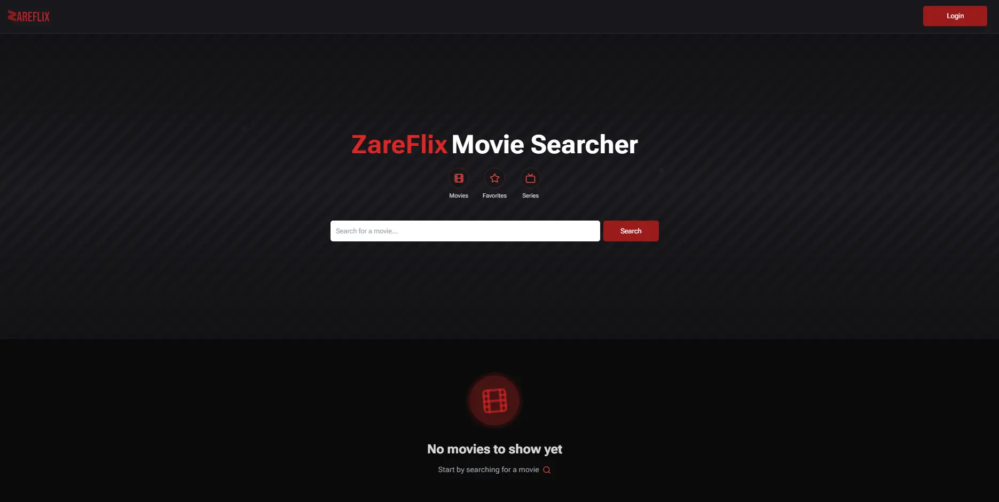
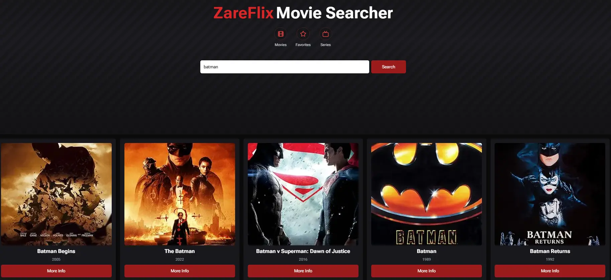
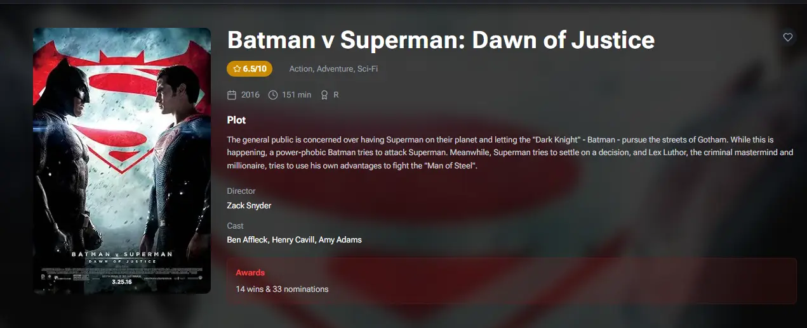
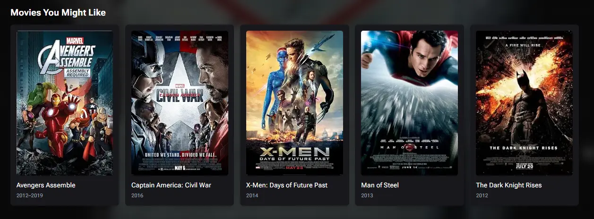
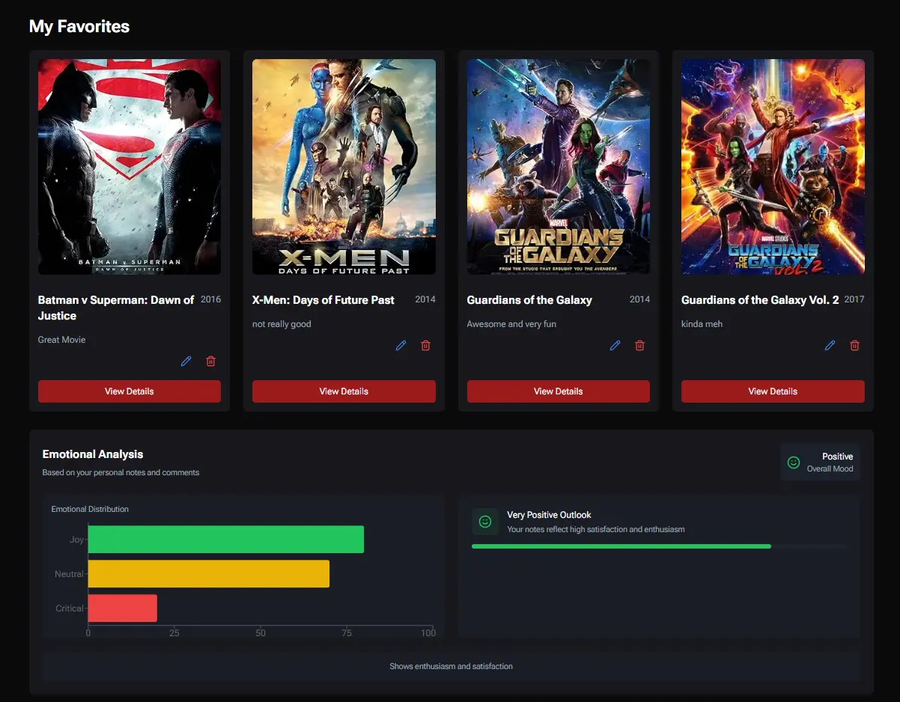

<div align="center">
  
  
  # ZareFlix Frontend 🎬
  
  <p align="center">
    
  </p>

[](https://nextjs.org/)
[](https://www.typescriptlang.org/)
[](https://tanstack.com/query/latest)
[](https://tailwindcss.com/)

</div>

## 📸 Screenshots

<div align="center">
  
  
</div>

<div align="center">
  
  
</div>

## 📚 Table of Contents

- [Features](#-features)
- [Tech Stack](#tech-stack)
- [Project Structure](#-project-structure)
- [Getting Started](#getting-started)

## 🌟 Features

### Core Features

- Advanced movie search with real-time filtering
- AI-powered movie recommendations and sentiment analysis
- Favorite movie management with personal notes
- Responsive design with modern animations
- Server-side rendering for optimal performance

### User Experience

- Pagination for movie listings
- Skeleton loading states
- Optimistic updates for favorites
- Error boundaries and fallbacks
- Toast notifications for user actions

## Tech Stack

### Core

- Next.js 15.0.3
- React 19.0
- TypeScript 5.0

### State Management & Data Fetching

- TanStack Query (React Query) 5.0

### Styling

- TailwindCSS
- Framer Motion
- NextUI Components

### Authentication

- Auth0 React SDK

### Testing

- Jest
- React Testing Library

## 📁 Project Structure

```bash
src/
├── app/                    # Next.js 13+ app directory
│   ├── layout.tsx         # Root layout
│   ├── page.tsx           # Home page
│   ├── movie/[id]/        # Movie details routes
│   └── favorites/        # Favorites movie route (protected)
├── components/
│   ├── features/          # Feature-specific components
│   ├── layout/            # Layout components
│   └── ui/                # Reusable UI components
├── hooks/                 # Custom hooks
├── services/              # API services
├── types/                 # TypeScript definitions
├── context/              # React Context providers
└── utils/                # Utility functions
```

## Getting Started

### Prerequisites

```bash
Node.js >= 18.0.0
npm >= 9.0.0
```

### Environment Setup

Create a .env.local file:

```bash
# API Configuration
NEXT_PUBLIC_OMDB_API_KEY=your_key
NEXT_PUBLIC_BACKEND_URL=http://localhost:3001

# Auth0 Configuration
AUTH0_SECRET=your_secret
AUTH0_BASE_URL=your_auth0_baseUrl
AUTH0_ISSUER_BASE_URL=your_domain
AUTH0_CLIENT_ID=your_client_id
AUTH0_CLIENT_SECRET=your_client_secret
AUTH0_AUDIENCE=your_audience
```

### Installation

```bash
# Install dependencies
npm install

# Run development server
npm run dev

# Build for production
npm run build

# Start production server
npm start
```

## 👥 Contributing

- Fork the repository
- Create a feature branch
- Commit your changes
- Push to the branch
- Create a Pull Request

## 🙏 Acknowledgments

- OMDB API for movie data
- Auth0 for authentication
- Hugging Face for AI capabilities
- Next.js team for the framework
- AWS Amplify for inspiration and deployment 
